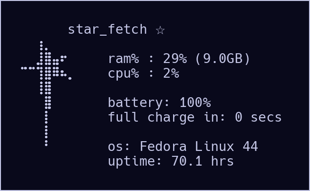
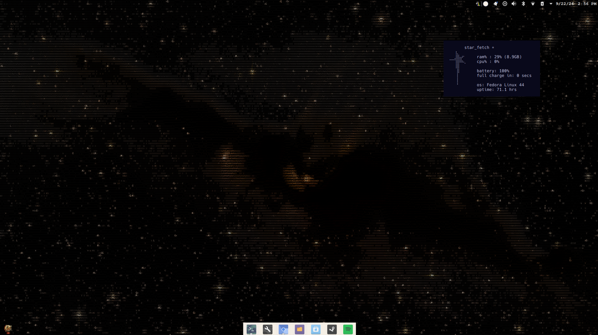

# star_fetch

<p align="center">
  
  &nbsp;
  
</p>

konsole widget that fetches ram/cpu/battery info/os/uptime and
watches for system changes for update every 30 seconds


uses 2 different konsole themes: blue and blonde 
font: Hack 10

roughly 70% vibe-coded. works. 

## Install (Fedora / KDE Plasma)

```
bash star_fetch-installer.sh
```


## Use

```
star_fetch          # start the widget
star_fetch end      # stop it
star_fetch blue     # blue colors (navy background, lavender text)
star_fetch blonde   # blonde colors (the default)
star_fetch border   # toggles border on/off
```


## Options (Fedora / KDE Plasma)

```
--position X,Y   top-left corner in pixels (default 1424,130)
--size W,H       size in pixels (default 310,180)
--autostart      start the widget at login
--no-start       don't start it after installing
--uninstall      remove everything
```

Requires `konsole procps-ng kf6-kconfig dbus-tools`, plus `upower` for
battery stats and `source-foundry-hack-fonts` for the exact fit. The installer prints the `dnf install` line if any are missing.


## Editing

The stats script, ascii template, `star_fetch` command, Konsole profile and
color schemes are embedded word for word in `star_fetch-installer.sh`, each in
a `STAR_FETCH_EOF` heredoc. Edit them there and re-run the installer.
